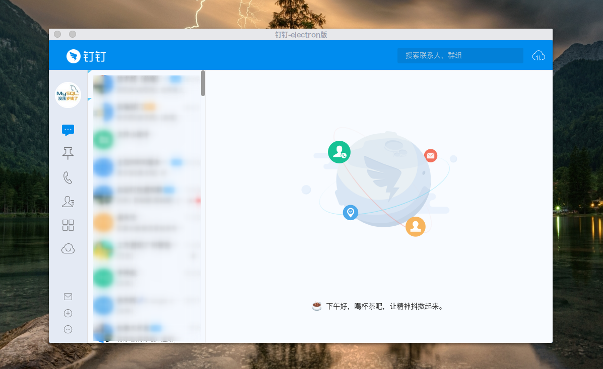

# 钉钉App - Linux版
> `非官方版`

> 最新的3.8.7改用electron封装。
>> 因为最近钉钉取消了账号登录, 所以移除了之前记住账号的 注入脚本。
>> 注入改为缓存登录token, 然后在下次启动时,把token放出来, 以达到自动登录的效果。(token的有效期为15天, 这是钉钉自己设置的, 项目没有对它进行任何修改)
>> **`注意: 该注入不一定能用。`**

该修改版并不对钉钉现有功能进行任何的修改,也不收集任何信息。
代码量很少, 而且完全开源, 请放心使用。





## 打包好的安装包
请进入`release`页面下载.


## 自行打包
```bash
# 下载源码, 进入源码目录
npm i
npm run pack
```

## 截图功能
现在linux下已经有一个非常好用的截图工具(`flameshot`)了, 这里就不再做截图这种多余的事了。


**注:** 本程序只是为了方便个人使用而进行的封装, 现在应网友要求上传到github供学习参考之用, 请勿用于非法途径, 由此产生的一切后果与本人无关。